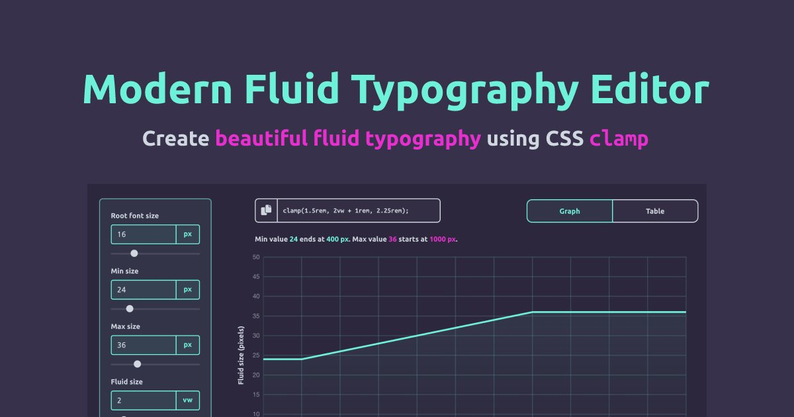

# Modern Fluid Typography Editor

<p align="center">

</p>

- Easily create and fine-tune fluid typography values
- Modern CSS with CSS `clamp`
- Code snippet generation
- Supports user-defined font preferences
- Build with Svelte

## Setup

```
npm install
```

## Run project

```
npm run dev
```

## Bugs and issues?

Feel free to open the issue in project's repository and contribute code!

## Support

[Buy me a coffee!](https://www.buymeacoffee.com/ubnZ8GgDJ)
